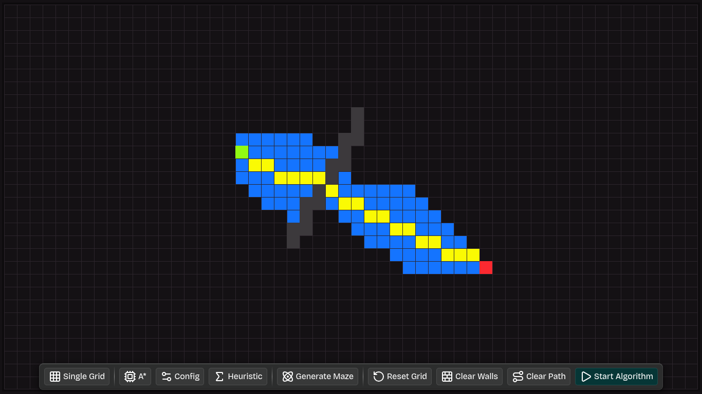
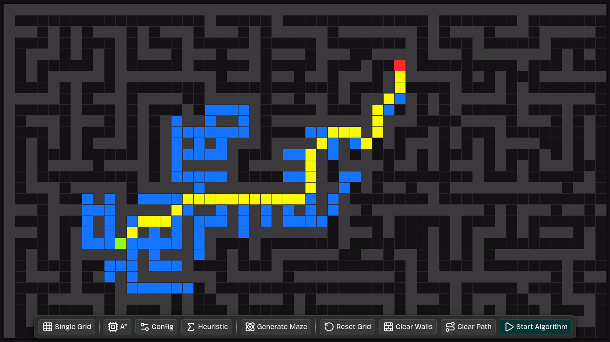
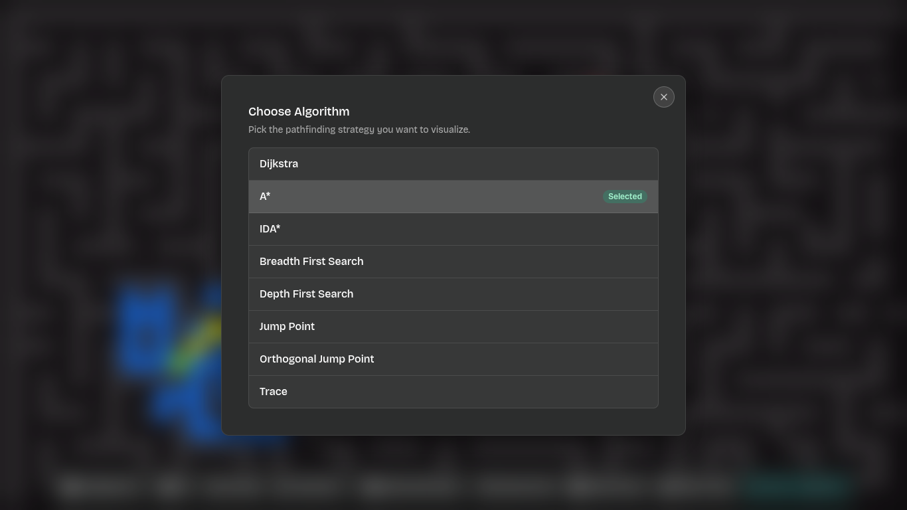
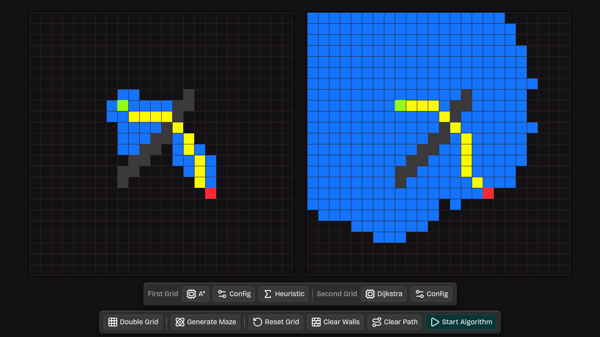

## ShortPathFinder

Interactive pathfinding visualizer that runs graph-search algorithms over a 2D grid in the browser.  
The UI is written in React/TypeScript and talks to a high‑performance C++ core compiled to WebAssembly.

---

## 1. Table of contents

1. **Overview**
2. **Tech stack**
3. **How to run locally**
   - 3.1. Install dependencies
   - 3.2. Start the dev server
   - 3.3. Production build, preview and tooling
4. **High‑level architecture**
   - 4.1. Frontend React app (`src/`)
   - 4.2. State management (Zustand stores)
   - 4.3. WebAssembly bridge
   - 4.4. C++ pathfinding core (`cpp/`)
5. **Grid, cells and interactions**
6. **Algorithms and heuristics**
   - 6.1. Frontend algorithm types
   - 6.2. C++ algorithm implementations
   - 6.3. Heuristic implementations
7. **Frontend code tour (`src/` file by file)**
   - 7.1. Entrypoint and routing
   - 7.2. Pages
   - 7.3. Components
   - 7.4. Hooks
   - 7.5. Stores
   - 7.6. Services
   - 7.7. Utilities
   - 7.8. Types and constants
   - 7.9. Styling and HTML shell
8. **C++ code tour (`cpp/` file by file)**
   - 8.1. Public API and bindings
   - 8.2. Core algorithms and graph
   - 8.3. Heuristics
   - 8.4. Types and utilities
   - 8.5. Build system (Makefile)
9. **Grid encoding, node IDs and result shape**
10. **Keyboard shortcuts and controls**

---

## 2. Overview

**ShortPathFinder** lets you:

- **Draw/edit a grid** and place start/end nodes and walls.
- **Generate mazes** and then run pathfinding on top of them.
- **Visualize algorithms** step‑by‑step (visited order and final path).
- **Compare algorithms side‑by‑side** in double‑grid mode, including basic statistics.
- **Hear audio feedback** as the search progresses (visited nodes, final path, success chord).

The frontend is a focused visualization and interaction layer; the actual shortest‑path computation is delegated to a reusable C++ library compiled to WebAssembly.

---

## 3. Tech stack

- **Frontend**
  - React 19, TypeScript
  - Vite 7
  - Tailwind CSS 4 (via `@tailwindcss/vite`)
  - Zustand for state management
  - Framer Motion for animations
  - Lucide React for icons
  - Tone.js for audio feedback
- **Pathfinding core**
  - Modern C++17
  - Custom graph abstraction over a grid
  - Core algorithms (e.g. A*, Dijkstra, BFS)
  - Heuristics (Manhattan, Euclidean, Octile, Chebyshev)
  - Compiled to WebAssembly with **Emscripten** and exposed via **embind**

Package definitions and scripts live in `package.json`.

---

## 4. How to run locally

### 4.1. Clone and install

```bash
git clone https://github.com/ayyoubelkouri/ShortPathFinder.git
cd ShortPathFinder

# Install dependencies
npm install
```

### 4.2. Start the development server

```bash
npm run dev
```

Then open the printed URL (by default `http://localhost:5173`) in your browser.

The dev server uses Vite, React Fast Refresh and the Tailwind V4 pipeline configured in `vite.config.ts` and `src/styles/globals.css`.

### 4.3. Production build, preview and tooling

- **Build production assets**

  ```bash
  npm run build
  ```

- **Preview the production build locally**

  ```bash
  npm run preview
  ```

- **Formatting, linting and checks**

  ```bash
  # Format with Biome
  npm run format

  # Lint with Biome
  npm run lint

  # Combined checks (Biome)
  npm run check
  ```

- **Testing (Jest + Testing Library)**

  ```bash
  npm test           # or: npm run test
  npm run test:watch
  npm run test:coverage
  ```

All scripts and dev dependencies are defined in `package.json`.

---

## 5. High‑level architecture

### 5.1. Frontend React app (`src/`)

- **Entrypoint**: `src/main.tsx`
  - Creates the React root and renders the `Router` component.
  - Imports global styles from `src/styles/globals.css`.

- **Router**: `src/pages/Router.tsx`
  - Reads the current `ApplicationMode` from `useModeStore`.
  - Chooses between `SingleGrid` and `DoubleGrid` views.
  - Always renders the `SplashScreen` overlay on top when the app starts.

- **Pages**: `src/pages/SingleGrid.tsx` and `src/pages/DoubleGrid.tsx`
  - `SingleGrid`:
    - Renders a single `Grid` component centered on a dark background.
    - Shows the `SingleGridPanel` overlay when no algorithm is running.
  - `DoubleGrid`:
    - Renders two `Grid` instances side‑by‑side, sharing layout but using different state slices.
    - Shows configuration (`DoubleGridConfigPanel`) and run controls (`DoubleGridRunPanel`) at the bottom.
    - After a run, shows a modal with two `RunStatsCard` components comparing cost and visited counts for each grid.

### 5.2. State management (Zustand stores)

All stores live under `src/stores` and are re‑exported by `src/stores/index.ts`.

- **Grid store**: `src/stores/grid.store.ts`
  - Centralizes all grid‑related state:
    - `rows`, `cols` – grid dimensions.
    - `cellules` – primary 2D array of `Cellule` objects (for single grid / first grid).
    - `secondCellules` – mirrored grid used by the second algorithm in double‑grid mode.
    - `history` – undo/redo history (see `historyManager`).
    - `isRunning` – indicates if a pathfinding execution is in progress.
    - Temporary drag state: `tempCellules`, `originalGridForDrag`.
  - Exposes actions:
    - `setRows`, `setCols` – resize the grid and recreate initial cells.
    - `updateCell` – update one or more cells with rich drag semantics and history integration.
    - `clearWalls`, `clearPath`, `resetGrid`, `prepareGrid` – wrappers around service functions in `src/services/gridOperations.ts`.
    - `generateMaze` – delegates to `src/services/generateMaze.ts` and syncs both grids.
    - `setIsRunning` – mark algorithm progress.
    - `undo`, `redo`, `canUndo`, `canRedo` – work with the functional history manager in `src/services/historyManager.ts`.

- **Algorithm stores**: `src/stores/algorithm.store.ts`
  - There are two independent stores using the same `AlgorithmStore` shape:
    - `useAlgorithmStore` – state for the first grid.
    - `useSecondAlgorithm` – state for the second grid.
  - Each store manages:
    - `algorithm: Algorithm` – which algorithm is selected.
    - `config: PathfindingConfig` – options such as diagonals, corner‑crossing, bidirectionality and heuristic.
    - `lastResult` – last run statistics (`cost` and `visited` nodes).
    - `setAlgorithm`, `setConfig`, `setLastResult` – update methods, with automatic heuristic handling via `isHeuristic`.

- **Mode store**: `src/stores/mode.store.ts`
  - Manages the `ApplicationMode` (`Single Grid` vs `Double Grid`).
  - Exposes `setMode` to toggle between modes.

### 5.3. WebAssembly bridge

The bridge between React and the C++ pathfinding engine is implemented in:

- **WASM loader**: `src/utils/loader.utils.ts`
  - Lazily loads `/wasm/pathfinding.js` at runtime (from `public/wasm/pathfinding.js`).
  - Exposes `loadWasm()` which:
    - Injects a `<script>` tag pointing to the embind‑generated JS file.
    - Reads the global `window.PathfindingModule` factory.
    - Initializes the WebAssembly module and returns a `MainModule` instance.
  - Maintains an internal promise cache so the module is loaded once per session.

- **WebAssembly hook**: `src/hooks/useWebAssembly.ts`
  - Wraps the loader in a React‑friendly API:
    - `ready: boolean` – set once the WASM module is fully initialized.
    - `findPath(params: PathfindingParams): PathfindingResponse` – thin wrapper that:
      - Constructs the C++ `PathfindingConfig` object from the given params.
      - Calls `Module.PathfindingAPI.findPath(...)`.
      - Normalizes the result to pure JS arrays and numbers (`path`, `visited`, `success`, `cost`, `time`).
  - Stores the module instance in a `ref` so it can be reused without re‑loading.

- **Run orchestration**: `src/hooks/useRun.ts`
  - High‑level hook that coordinates:
    - Grid preparation (`prepareGrid`).
    - Mode and algorithm selection (from `useModeStore`, `useAlgorithmStore`, `useSecondAlgorithm`).
    - WebAssembly execution via `useWebAssembly`.
    - Visual animation of visited nodes and the final path.
    - Audio feedback via `useSound`.
  - Main public method: `execute()`, returned as `{ execute }`.
  - Execution flow:
    1. Prepare grid and mark `isRunning`.
    2. Find start and end cells (`startId`, `goalId`) by scanning `cellules`.
    3. Build a compact `Uint8Array` where `1` marks walls and `0` marks walkable cells.
    4. Map frontend `Algorithm` and `Heuristic` enums into the embind `AlgorithmType`/`HeuristicType` numeric wrappers required by the WASM bindings.
    5. Call `findPath` with the grid data and config.
    6. Convert the returned node IDs back into `(x, y)` coordinates and animate:
       - First the `visited` sequence.
       - Then the final `path`.
    7. Persist `lastResult` statistics in the algorithm stores.
    8. Reset `isRunning`.

### 5.4. C++ pathfinding core (`cpp/`)

The C++ library is a reusable, backend‑agnostic pathfinding engine:

- Exposes a **single high‑level API**: `PathfindingEngine::findPath(...)`.
- Builds a `GridGraph` from an integer grid (0 = walkable, non‑zero = blocked).
- Selects a concrete algorithm via `AlgorithmFactory`.
- Optionally selects a heuristic via `HeuristicFactory` (for A* or other informed searches).
- Returns a `Result` with:
  - `std::vector<NodeId> path`
  - `std::vector<NodeId> visited`
  - `double cost`
  - `bool success`
  - `std::chrono::microseconds time`

The WebAssembly bindings wrap this API and convert between JS arrays and native structures.

---

## 6. Grid, cells and interactions

### 6.1. Grid model

Grid cells are represented by:

- **Type**: `Cellule` in `src/types/grid.d.ts`
  - `id: number` – unique identifier within the grid.
  - `x: number`, `y: number` – coordinates.
  - `state: CellState` – one of:
    - `"empty"`, `"start"`, `"end"`, `"wall"`, `"path"`, `"visited"`.

Cell colors and size:

- `CELL_COLORS` in `src/constants/grid.constants.ts` drive the visual color for each state.
- `CELL_SIZE` defines the pixel size of each cell.

### 6.2. Grid rendering

- Component: `src/components/Grid.tsx`
  - Reads `cellules` (or `secondCellules` for the second grid) via the `useGrid` hook.
  - Uses CSS grid with rows/columns computed from the 2D array shape and `CELL_SIZE`.
  - Renders a `<button>` for each cell, colored according to `getCellColor(state)` from `src/utils/grid.utils.ts`.
  - Adds thin borders between cells and handles mouse interactions:
    - `onMouseDown` marks the start of a drag edit.
    - `onMouseEnter` applies edits while dragging.
    - `onMouseUp` finalizes edits and commits a history command.

### 6.3. User interactions and undo/redo

- Hook: `src/hooks/useGrid.ts`
  - Calculates grid dimensions from the viewport using `useScreen` and `CELL_SIZE`.
  - For **single grid mode**, it uses the full viewport; for **double grid mode**, it caps width/height to a fixed 600×600 viewport so two grids can fit side‑by‑side.
  - Registers global keyboard listeners:
    - `Ctrl/Cmd + Z` → `undo`.
    - `Ctrl/Cmd + Y` → `redo`.
  - Manages mouse drag state (`isMouseDown`), delegates to `updateCell` in the grid store and exposes:
    - `handlers: { mouseDown, mouseEnter, mouseUp }`
    - `actions: { clearWalls, clearPath, resetGrid, generateMaze }`

- History management: `src/services/historyManager.ts` and `src/types/history.d.ts`
  - Stores **deltas only**, not full grid snapshots:
    - `CellDelta` captures point‑wise transitions `{ x, y, previousState, newState }`.
  - Commands (`Command`) represent high‑level operations like `"UPDATE_CELLS"`, `"CLEAR_WALLS"`, `"GENERATE_MAZE"`.
  - `HistoryState` stores two stacks: `undoStack` and `redoStack`.
  - Public API:
    - `createEmptyHistory`, `clearHistory`
    - `createCommand`, `executeCommand`
    - `undo`, `redo`, `canUndo`, `canRedo`
    - `applyDeltasReverse`, `applyDeltasForward`

- Grid operations: `src/services/gridOperations.ts`
  - `clearWalls` – converts walls, visited and path cells back to `"empty"`.
  - `clearPath` – clears only `"path"` and `"visited"` cells.
  - `resetGrid` – sets every cell state to `"empty"`.
  - `prepareGrid` – clears any previously drawn path or visited cells before a new run, without recording history.

### 6.4. Maze generation

- Service: `src/services/generateMaze.ts`
  - Implements **recursive backtracking** over the grid, using an internal seeded random number generator.
  - Steps:
    1. Initialize all cells as `"wall"` (except any existing `"start"`/`"end"`).
    2. Choose a starting cell (prefer odd coordinates).
    3. Recursively carve passages by jumping two cells in random directions and opening intermediate walls.
    4. Make `"start"` and `"end"` cells reachable by clearing nearby walls.
    5. Ensure there is a path between `"start"` and `"end"` with a BFS‑based reachability check and, if necessary, carve a direct path.
    6. Add a few random openings to create loops and more interesting layouts.

The grid store wraps this function so that both `cellules` and `secondCellules` share the same maze layout.

---

## 7. Algorithms and heuristics

### 7.1. Frontend algorithm types

Defined in `src/types/algorithm.d.ts`:

- **`Algorithm` enum** – the UI‑level algorithm selector:
  - `"Dijkstra"`, `"A*"`, `"IDA*"`, `"Breadth First Search"`, `"Depth First Search"`, `"Jump Point"`, `"Orthogonal Jump Point"`, `"Trace"`.
- **`Heuristic` enum** – heuristics for informed searches:
  - `"Manhattan"`, `"Euclidean"`, `"Octile"`, `"Chebyshev"`.

Helpers:

- `src/utils/algorithm.utils.ts`:
  - `isHeuristic(algorithm: Algorithm): boolean` – indicates whether the given algorithm uses a heuristic, which drives whether the `HeuristicSelector` is shown and how configs are interpreted.

Configuration:

- `DEFAULT_CONFIG` in `src/constants/algorithm.constants.ts` defines default pathfinding options.
- `PathfindingConfig` in `src/types/algorithm.d.ts` is used by both the stores and the WebAssembly hook.

### 7.2. C++ algorithm implementations

Algorithm types in C++ are enumerated in `cpp/includes/types/Enums.hh` as `AlgorithmType`:

- `BFS`, `DIJKSTRA`, `ASTAR`, `IDASTAR`, `DFS`, `JUMPPOINT`, `ORTHOGONALJUMPPOINT`, `TRACE`.

The **interfaces and implementations** are organized as:

- **Common base**
  - Interface: `cpp/includes/core/algorithms/IAlgorithm.hh`
    - Declares `Result findPath(const IGraph&, NodeId start, NodeId goal, const AlgorithmConfig& config)`.
  - Config type and `Result` live in `cpp/includes/types/Structs.hh`.

- **Concrete algorithms (headers)**
  - `cpp/includes/core/algorithms/Dijkstra.hh` – Dijkstra’s shortest‑path algorithm.
  - `cpp/includes/core/algorithms/AStar.hh` – A* with pluggable heuristics.
  - `cpp/includes/core/algorithms/BFS.hh` – breadth‑first search over an unweighted grid graph.

- **Concrete algorithms (implementations)**
  - `cpp/src/Dijkstra.cc` – actual Dijkstra implementation using a priority queue over `IGraph`.
  - `cpp/src/AStar.cc` – A* implementation, integrating heuristics from `IHeuristic`.
  - `cpp/src/BFS.cc` – BFS implementation, tracking visited order and reconstructing the path.

Factory and engine:

- `cpp/includes/core/factories/AlgorithmFactory.hh` and `cpp/src/AlgorithmFactory.cc`
  - Central place that maps `AlgorithmType` values to concrete `IAlgorithm` implementations.
- `cpp/includes/api/PathfindingEngine.hh` and `cpp/src/PathfindingEngine.cc`
  - High‑level engine that:
    - Builds a `GridGraph` from a flattened integer grid.
    - Applies `AlgorithmType` and `HeuristicType`.
    - For A*, instantiates the appropriate heuristic.
    - Delegates to the chosen algorithm’s `findPath` and returns a `Result`.

### 7.3. Heuristic implementations

Heuristic types are defined in `cpp/includes/types/Enums.hh` as `HeuristicType`:

- `MANHATTAN`, `EUCLIDEAN`, `OCTILE`, `CHEBYSHEV`.

Core heuristic interfaces and implementations:

- Interface: `cpp/includes/core/heuristics/IHeuristic.hh`
  - Abstract method for estimating distance between two nodes.
- Concrete heuristics (headers):
  - `cpp/includes/core/heuristics/Manhattan.hh`
  - `cpp/includes/core/heuristics/Euclidean.hh`
  - `cpp/includes/core/heuristics/Octile.hh`
  - `cpp/includes/core/heuristics/Chebyshev.hh`
- Implementations:
  - `cpp/src/Manhattan.cc`
  - `cpp/src/Euclidean.cc`
  - `cpp/src/Octile.cc`
  - `cpp/src/Chebyshev.cc`

Factory:

- `cpp/includes/core/factories/HeuristicFactory.hh` and `cpp/src/HeuristicFactory.cc`
  - Creates a concrete `IHeuristic` given a `HeuristicType` and a shared `IGraph` instance.

---

## 8. Frontend code tour (`src/`)

### 8.1. Entrypoint and routing

- `src/main.tsx`
  - Bootstraps the React app, imports global styles and renders `Router`.
- `src/pages/index.ts`
  - Barrel file re‑exporting `Router`.
- `src/pages/Router.tsx`
  - Selects between `SingleGrid` and `DoubleGrid` based on `ApplicationMode`.
  - Always displays `SplashScreen`.

### 8.2. Pages

- `src/pages/SingleGrid.tsx`
  - Layout:
    - Full‑screen dark background, centered single `Grid`.
    - A `SingleGridPanel` floating control bar at the bottom, faded out while an algorithm is running.
  - Uses `useGridStore` to read `isRunning`.

- `src/pages/DoubleGrid.tsx`
  - Layout:
    - Two `Grid` components horizontally aligned.
    - `DoubleGridConfigPanel` for algorithm/config selection for both grids.
    - `DoubleGridRunPanel` for generic actions and the run button.
    - Optional `RunStats` modal comparing two runs with `RunStatsCard`.
  - Uses `useAlgorithmStore` and `useSecondAlgorithm` for last run stats and resets them once the modal is dismissed.

### 8.3. Components

- `src/components/index.ts`
  - Exports panels, selectors, UI elements, `Grid` and `SplashScreen` for easy imports.

- **Panels**
  - `src/components/panels/SingleGridPanel.tsx`
    - Bottom control bar for single grid:
      - Mode selector.
      - Algorithm selector.
      - Config and heuristic selectors.
      - Maze generation and grid‑cleanup buttons.
      - Run button wired to `useRun().execute`.
  - `src/components/panels/DoubleGridConfigPanel.tsx`
    - Control bar for configuring each of the two grids independently:
      - For each grid: algorithm, config and optional heuristic selection.
  - `src/components/panels/DoubleGridRunPanel.tsx`
    - Control bar for double grid run actions:
      - Mode selector, maze generation, reset/clear actions and the run button.

- **Selectors**
  - `src/components/selectors/AlgoSelector.tsx`
    - Uses `PopupContainer` and `Selector` to show available `Algorithm` values.
    - Supports either the first or the second algorithm store via `useSecondState`.
  - `src/components/selectors/ConfigSelector.tsx`
    - Popup for toggling `dontCrossCorners`, `allowDiagonal`, `bidirectional` using `Switcher` components.
  - `src/components/selectors/HeuristicSelector.tsx`
    - Popup listing `Heuristic` values, used only when the chosen algorithm is heuristic‑based.
  - `src/components/selectors/ModeSelector.tsx`
    - Popup for choosing between `ApplicationMode.SingleGrid` and `ApplicationMode.DoubleGrid`.

- **UI primitives**
  - `src/components/ui/Button.tsx`
    - Button with optional icon, label and keyboard shortcut hint.
    - Registers global `keydown` listener and matches user‑defined shortcuts such as `"M"`, `"R"`, `"Enter"`.
  - `src/components/ui/PopupContainer.tsx`
    - Wraps a `Button` and, when clicked, renders its children inside a full‑screen modal using `createPortal`.
  - `src/components/ui/Selector.tsx`
    - Generic selector list with `title`, `description` and items.
    - Each item can be clickable and/or have a custom right‑hand component (badge, switch).
  - `src/components/ui/Switcher.tsx`
    - Simple toggle switch used for Boolean config options.
  - `src/components/ui/Seperator.tsx`
    - Vertical or horizontal glowing separator line used in panels.
  - `src/components/ui/RunStatsCard.tsx`
    - Compact card displaying cost and visited‑cells count for a run.

- **Splash screen**
  - `src/components/SplashScreen.tsx`
    - Full‑screen overlay prompting the user to go fullscreen.
    - Auto‑hides after 2 seconds.
    - Provides a button that calls `document.documentElement.requestFullscreen()`.
    - Displays author credit and GitHub link.

### 8.4. Hooks

- `src/hooks/useGrid.ts`
  - See **Grid, cells and interactions** above.
- `src/hooks/useRun.ts`
  - See **WebAssembly bridge** above.
- `src/hooks/useWebAssembly.ts`
  - Handles loading and access to the WASM module.
- `src/hooks/helpers/useScreen.ts`
  - Returns `{ width, height }` and updates on `window.resize`.
- `src/hooks/helpers/useSound.ts`
  - Initializes two `Tone.Synth` instances (one for high‑pitched visit sounds, one for bass path/success).
  - Exposes:
    - `initializeAudio`
    - `playVisitedSound`
    - `playPathSound`
    - `playSuccessChord`

### 8.5. Stores

- `src/stores/grid.store.ts` – grid state and undo/redo.
- `src/stores/algorithm.store.ts` – algorithm configuration and last run stats for one grid, reused twice.
- `src/stores/mode.store.ts` – current application mode.
- `src/stores/index.ts` – barrel export.

### 8.6. Services

- `src/services/gridOperations.ts` – clear/prepare/reset grid helpers.
- `src/services/updateCell.ts` – logic for toggling a cell between `"empty"`, `"start"`, `"end"`, `"wall"`, `"path"`, `"visited"`, with single‑start and single‑end guarantees.
- `src/services/generateMaze.ts` – recursive backtracking maze generator and reachability enforcement.
- `src/services/historyManager.ts` – pure, functional history and diffing library used by the grid store.
- `src/services/index.ts` – barrel export.

### 8.7. Utilities

- `src/utils/grid.utils.ts`
  - `getCellColor` – maps `CellState` to `CELL_COLORS`.
  - `isWithinBounds` – bounds checking helper.
  - `findSpecialCells` – locates `"start"` and `"end"` cells in the grid.
  - `createInitialGrid`, `deepCopyGrid` – grid construction and cloning helpers.
- `src/utils/algorithm.utils.ts`
  - `isHeuristic` – determines whether a given `Algorithm` uses a heuristic.
- `src/utils/loader.utils.ts`
  - Lazy loader for the WebAssembly wrapper (`/wasm/pathfinding.js`).
- `src/utils/index.ts`
  - Barrel export for utilities.

### 8.8. Types and constants

- `src/types/app.d.ts`
  - `ApplicationMode` enum (`Single Grid`, `Double Grid`).
- `src/types/grid.d.ts`
  - `CellState`, `Cellule`.
- `src/types/algorithm.d.ts`
  - `Algorithm`, `Heuristic`, `PathfindingParams`, `PathfindingResponse`, `PathfindingConfig`.
- `src/types/history.d.ts`
  - `CellDelta`, `CommandType`, `Command`, `HistoryState`.
- `src/types/maze.d.ts`
  - `MazeGenerationParams`.
- `src/types/index.ts`
  - Barrel export for all type definitions.

Constants:

- `src/constants/grid.constants.ts`
  - `CELL_COLORS`, `CELL_SIZE`.
- `src/constants/algorithm.constants.ts`
  - `DEFAULT_CONFIG`.
- `src/constants/index.ts`
  - Barrel export.

### 8.9. Styling and HTML shell

- `src/styles/globals.css`
  - Imports Tailwind.
  - Defines a custom `BricolageGrotesque` font family and global scrollbar styling.
  - Hides scrollbars and disables focus outlines to keep the visual experience focused on the grid.
- `index.html`
  - Minimal Vite HTML shell with a single `#root` div and script tag pointing to `/src/main.tsx`.

---

## 9. C++ code tour (`cpp/`)

### 9.1. Public API and JS bindings

- `cpp/includes/api/PathfindingEngine.hh`
  - Declares the `PathfindingEngine` class with a static `findPath(...)` function:
    - Input: `std::vector<int> grid`, grid size, start/goal indices, algorithm, heuristic, flags (`allowDiagonal`, `dontCrossCorners`, `bidirectional`).
    - Output: `Result` (path, visited, cost, success, time).
- `cpp/src/PathfindingEngine.cc`
  - Implements `findPath`:
    - Builds a vector of `Node` instances from the raw integer grid.
    - Each `Node` stores:
      - `NodeId id`.
      - Grid coordinates.
      - `walkable` boolean (zero cell → walkable).
      - Constant `cost` currently set to `1.0` for all nodes.
    - Wraps the nodes into a `GridGraph`.
    - Constructs a heuristic (for A*) via `HeuristicFactory`.
    - Builds an `AlgorithmConfig` and runs the selected algorithm via `AlgorithmFactory`.

- **JS/WASM binding layer**
  - `cpp/includes/api/Binding.hh`
    - Defines `api::PathfindingConfig` (algorithm, heuristic, allowDiagonal, dontCrossCorners, bidirectional).
    - Declares `api::PathfindingAPI` with a static `findPath` method taking JS arrays via `emscripten::val`.
  - `cpp/src/Bindings.cc`
    - Implements `PathfindingAPI::findPath`:
      - Converts JS array (`Uint8Array` or regular array) into `std::vector<int>`.
      - Calls `PathfindingEngine::findPath`.
      - Builds a JS object with `path`, `visited`, `cost`, `success`, `time_us`.
    - Declares embind bindings:
      - `AlgorithmType` and `HeuristicType` enums.
      - `api::PathfindingConfig` struct.
      - `api::PathfindingAPI` class with a static `findPath` method callable from JS.

### 9.2. Core algorithms and graph

- **Graph abstraction**
  - `cpp/includes/core/graph/IGraph.hh`
    - Abstract graph API exposing:
      - `getNodeCount()`
      - `getNeighbors(NodeId, std::vector<Edge>&)`
      - `getNodePosition(NodeId)`
  - `cpp/includes/core/graph/GridGraph.hh` and `cpp/src/GridGraph.cc`
    - Concrete implementation for grid‑based graphs backed by a contiguous `std::vector<Node>`.
    - Computes neighbors based on grid width/height, respecting node walkability.

- **Algorithm interfaces**
  - `cpp/includes/core/algorithms/IAlgorithm.hh`
    - Base class for all algorithms.

- **Algorithm implementations (headers and sources)**
  - `cpp/includes/core/algorithms/Dijkstra.hh` / `cpp/src/Dijkstra.cc`
    - Classic Dijkstra’s algorithm using a priority queue and distance map.
  - `cpp/includes/core/algorithms/AStar.hh` / `cpp/src/AStar.cc`
    - A* algorithm using the heuristic from `IHeuristic` and the same graph abstraction.
  - `cpp/includes/core/algorithms/BFS.hh` / `cpp/src/BFS.cc`
    - Breadth‑first search for unweighted shortest path.

- **Factories**
  - `cpp/includes/core/factories/AlgorithmFactory.hh` / `cpp/src/AlgorithmFactory.cc`
    - Given an `AlgorithmType`, returns a `std::unique_ptr<IAlgorithm>` instance.

### 9.3. Heuristics

- **Interfaces and types**
  - `cpp/includes/core/heuristics/IHeuristic.hh` – base interface for all heuristics.
  - `cpp/includes/core/heuristics/*.hh` and `cpp/src/*HeuristicName*.cc` – concrete heuristic classes.
  - `cpp/includes/types/Enums.hh` – defines `HeuristicType`.

- **Factory**
  - `cpp/includes/core/factories/HeuristicFactory.hh` / `cpp/src/HeuristicFactory.cc`
    - Returns a `std::unique_ptr<IHeuristic>` based on `HeuristicType`, using the `IGraph` for distance computations.

### 9.4. Types and utilities

- `cpp/includes/types/Usings.hh`
  - Type aliases such as `NodeId`, `NodeCount`, etc.
- `cpp/includes/types/Structs.hh`
  - Defines:
    - `Point` (x, y).
    - `Node` – basic graph node with position, walkability and traversal cost.
    - `Edge` – neighbor relationship with cost.
    - `AlgorithmConfig` – configuration passed into algorithms.
    - `Result` – pathfinding output (path, visited, cost, success, time).
- `cpp/includes/utils/Logger.hh` / `cpp/src/Logger.cc`
  - Simple logging helper used throughout the core.

### 9.5. Build system (Makefile)

- File: `cpp/Makefile`
  - **Native build**:
    - `make` or `make native` → builds `bin/test_app`.
    - `make run` → runs the test application.
  - **WebAssembly build** (requires Emscripten/emcc on PATH):
    - `make wasm` → debug‑oriented WASM build, producing:
      - `bin/pathfinding.js`
      - `bin/pathfinding.wasm`
      - `bin/pathfinding.d.ts` (TypeScript declarations, moved automatically).
    - `make wasm-release` → optimized WASM build.
  - **Utilities**:
    - `make clean`, `make distclean` – remove build artifacts.
    - `make format` – run `clang-format` over `src/` and `includes/` if available.

To integrate a freshly built WASM bundle into the frontend, copy or point the output files to `public/wasm/pathfinding.js` (and the corresponding `.wasm`), matching the path expected in `src/utils/loader.utils.ts`.

---

## 10. Grid encoding, node IDs and result shape

The communication between the React app and the C++ engine uses a compact, shared convention:

- **Grid encoding**
  - Frontend flattens the 2D `cellules` matrix into a single array of length `width * height`.
  - Cell values:
    - `0` – walkable cell (anything not a wall).
    - `1` – blocked cell (walls).
  - The C++ engine interprets non‑zero entries as obstacles and sets `Node::walkable` accordingly.

- **Node IDs**
  - Node IDs are computed in **row‑major** order:
    - `nodeId = y * width + x`.
  - React reconstructs `(x, y)` from each `nodeId` when animating visited paths.

- **Result shape**
  - C++ `Result` → JS object via embind:
    - `path: number[]` – sequence of node IDs representing the final path.
    - `visited: number[]` – exploration order of visited nodes.
    - `cost: number` – accumulated edge cost (double).
    - `success: boolean` – indicates if a path to the goal was found.
    - `time_us: number` – time spent in microseconds on the engine side.
  - The WebAssembly hook maps `time_us` to the `time` field in `PathfindingResponse`.

---

## 11. Keyboard shortcuts and controls

- **Global**
  - `Ctrl/Cmd + Z` – undo last grid edit.
  - `Ctrl/Cmd + Y` – redo last undone grid edit.

- **Panel buttons** (shortcuts are shown as tooltips on hover):
  - **Mode selection**
    - `G` – open mode selector (single vs double grid).
  - **Algorithm and configuration**
    - `A` – open algorithm selector.
    - `C` – open configuration selector.
    - `H` – open heuristic selector (when applicable).
  - **Grid operations**
    - `M` – generate a new maze.
    - `R` – reset grid.
    - `W` – clear walls.
    - `P` – clear path.
  - **Run**
    - `Enter` – start the pathfinding run.

You can interact directly with the grid by clicking and dragging:

- First click on an empty grid cell places the start.
- Second click places the end.
- Subsequent drags toggle walls or clear cells depending on current state.

This README is intentionally written to remain stable as the project grows: new algorithms, heuristics or UI features can be added by extending the existing enums, stores and factories without requiring structural changes to this document.

# React + TypeScript + Vite

This template provides a minimal setup to get React working in Vite with HMR and some ESLint rules.

Currently, two official plugins are available:

- [@vitejs/plugin-react](https://github.com/vitejs/vite-plugin-react/blob/main/packages/plugin-react) uses [Babel](https://babeljs.io/) (or [oxc](https://oxc.rs) when used in [rolldown-vite](https://vite.dev/guide/rolldown)) for Fast Refresh
- [@vitejs/plugin-react-swc](https://github.com/vitejs/vite-plugin-react/blob/main/packages/plugin-react-swc) uses [SWC](https://swc.rs/) for Fast Refresh

## React Compiler

The React Compiler is enabled on this template. See [this documentation](https://react.dev/learn/react-compiler) for more information.

Note: This will impact Vite dev & build performances.

## Expanding the ESLint configuration

If you are developing a production application, we recommend updating the configuration to enable type-aware lint rules:

```js
export default defineConfig([
  globalIgnores(['dist']),
  {
    files: ['**/*.{ts,tsx}'],
    extends: [
      // Other configs...

      // Remove tseslint.configs.recommended and replace with this
      tseslint.configs.recommendedTypeChecked,
      // Alternatively, use this for stricter rules
      tseslint.configs.strictTypeChecked,
      // Optionally, add this for stylistic rules
      tseslint.configs.stylisticTypeChecked,

      // Other configs...
    ],
    languageOptions: {
      parserOptions: {
        project: ['./tsconfig.node.json', './tsconfig.app.json'],
        tsconfigRootDir: import.meta.dirname,
      },
      // other options...
    },
  },
])
```

You can also install [eslint-plugin-react-x](https://github.com/Rel1cx/eslint-react/tree/main/packages/plugins/eslint-plugin-react-x) and [eslint-plugin-react-dom](https://github.com/Rel1cx/eslint-react/tree/main/packages/plugins/eslint-plugin-react-dom) for React-specific lint rules:

```js
// eslint.config.js
import reactX from 'eslint-plugin-react-x'
import reactDom from 'eslint-plugin-react-dom'

export default defineConfig([
  globalIgnores(['dist']),
  {
    files: ['**/*.{ts,tsx}'],
    extends: [
      // Other configs...
      // Enable lint rules for React
      reactX.configs['recommended-typescript'],
      // Enable lint rules for React DOM
      reactDom.configs.recommended,
    ],
    languageOptions: {
      parserOptions: {
        project: ['./tsconfig.node.json', './tsconfig.app.json'],
        tsconfigRootDir: import.meta.dirname,
      },
      // other options...
    },
  },
])
```
