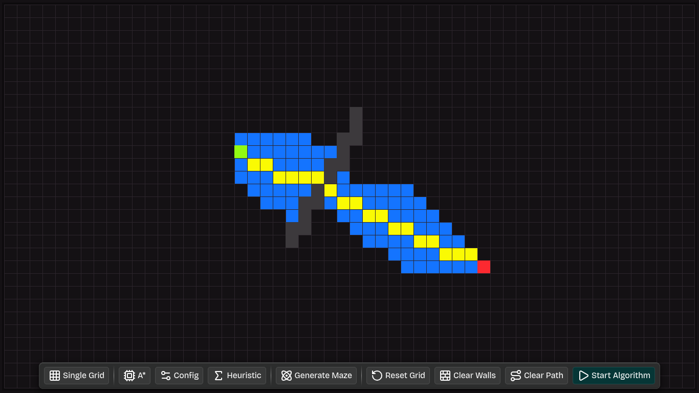
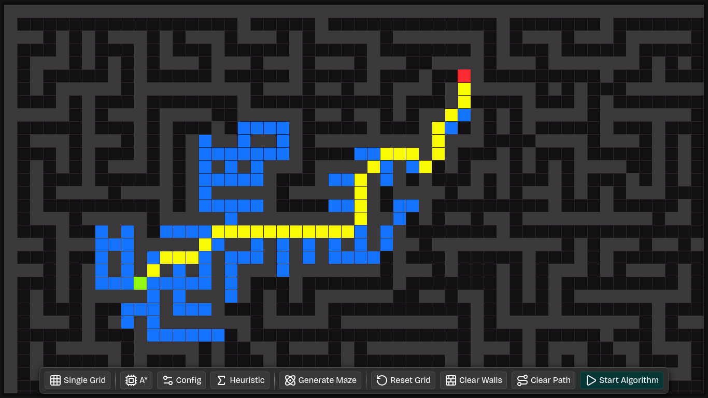
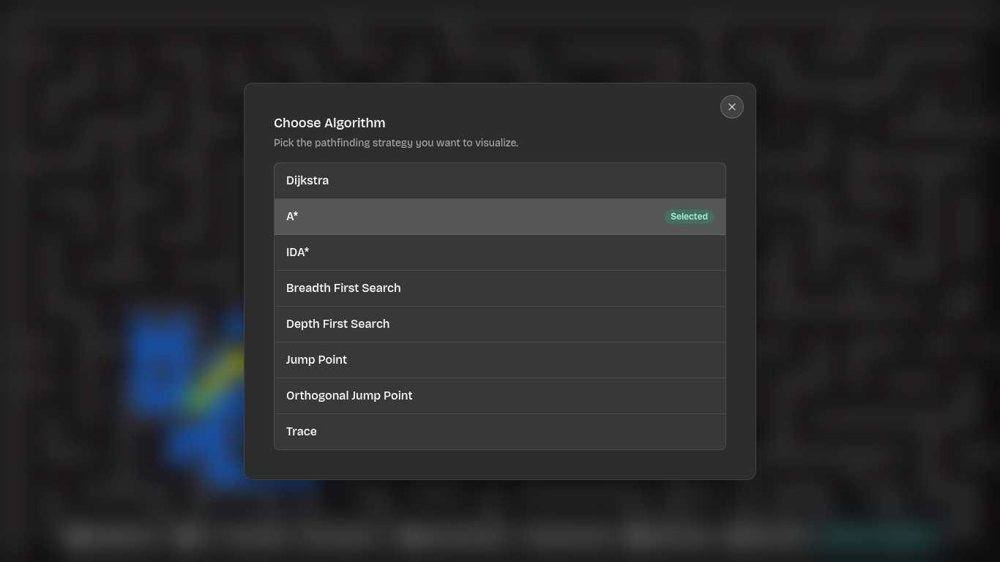
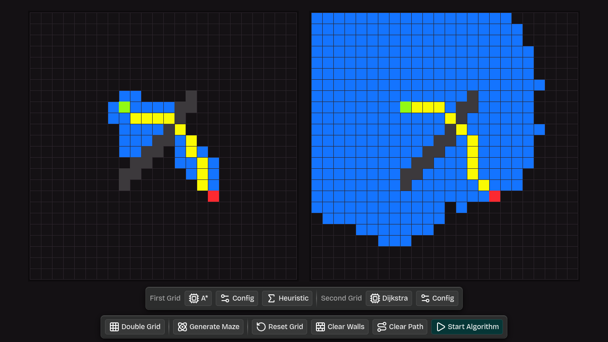

<!-- SEO Meta Tags
Description: Interactive pathfinding visualizer that runs graph-search algorithms (A*, Dijkstra, BFS, DFS) over a 2D grid in the browser. React/TypeScript frontend with a C++ WebAssembly core.
Keywords: pathfinding-visualizer, graph-search, A-star, Dijkstra, BFS, DFS, WebAssembly, React, TypeScript, C++, algorithm-visualization
author: Ayyoub EL Kouri
canonical: https://github.com/AyyoubElKouri/ShortPathFinder
-->

<!-- Open Graph / Facebook
og:type: website
og:url: https://github.com/AyyoubElKouri/ShortPathFinder
og:title: ShortPathFinder - Interactive Pathfinding Algorithm Visualizer
og:description: Draw, edit, and run graph-search algorithms on a 2D grid with real-time step-by-step animation. Compare algorithms side-by-side in double-grid mode. Powered by React/TypeScript and C++ compiled to WebAssembly.
og:image: docs/picture-1.png
og:image:alt: ShortPathFinder grid showing pathfinding visualization
og:site_name: ShortPathFinder
og:locale: en_US
-->

<!-- Twitter Card
twitter:card: summary_large_image
twitter:url: https://github.com/AyyoubElKouri/ShortPathFinder
twitter:title: ShortPathFinder - Interactive Pathfinding Algorithm Visualizer
twitter:description: Draw, edit, and run graph-search algorithms on a 2D grid with real-time step-by-step animation. Compare algorithms side-by-side in double-grid mode.
twitter:image: docs/picture-1.png
-->

<!-- GitHub Metadata
topics: pathfinding, visualization, algorithms, webassembly, react, typescript, cpp, graph-search
languages: typescript, c++
-->






<div align="center">

# ShortPathFinder

### Interactive pathfinding visualizer — graph-search algorithms on a 2D grid, powered by React and C++ WebAssembly

[](#)
[](https://www.typescriptlang.org/)
[](https://react.dev/)
[](https://isocpp.org/)
[](https://webassembly.org/)
[](#)


[**Live Demo**](https://ayyoubelkouri.github.io/ShortPathFinder/) • [**Report Bug**](https://github.com/AyyoubElKouri/ShortPathFinder/issues) • [**Request Feature**](https://github.com/AyyoubElKouri/ShortPathFinder/issues)

</div>

---

## Table of Contents

- [About](#-about)
- [Tech Stack](#-tech-stack)
- [Getting Started](#-getting-started)
- [Architecture](#-architecture)
- [Algorithms &amp; Heuristics](#-algorithms--heuristics)
- [Code Tour](#-code-tour)
- [Keyboard Shortcuts](#-keyboard-shortcuts)
- [Contributing](#-contributing)
- [License](#-license)

---

## About

**ShortPathFinder** is an interactive pathfinding visualizer that runs graph-search algorithms over a 2D grid directly in the browser. The UI is written in React and TypeScript, while the heavy pathfinding computation is delegated to a high-performance C++17 core compiled to WebAssembly via Emscripten.

### What you can do

- **Draw and edit a grid** — place start/end nodes and paint walls by clicking and dragging.
- **Generate mazes** — recursive backtracking with guaranteed reachability, then run pathfinding on top.
- **Visualize algorithms step-by-step** — watch visited nodes spread out then the final path animate in order.
- **Compare algorithms side-by-side** — double-grid mode shows two algorithms on the same maze with comparative statistics (cost, visited count).
- **Hear audio feedback** — sonification of search progress via Tone.js (visited nodes, final path, success chord).

---

## Tech Stack

| Layer | Technologies |
|-------|-------------|
| **Frontend** | React 19, TypeScript 5.9, Vite 7, Tailwind CSS 4, Zustand 5, Framer Motion, Lucide React |
| **Pathfinding core** | Modern C++17, custom grid-graph abstraction, compiled to WebAssembly with Emscripten (embind) |
| **Audio** | Tone.js |
| **Testing** | Jest, Testing Library |
| **Linting &amp; formatting** | Biome |

<details>
<summary><b>View all dependencies</b></summary>

### Core

```json
{
  "react": "^19.1.1",
  "react-dom": "^19.1.1",
  "zustand": "^5.0.8",
  "tailwindcss": "^4.1.17",
  "motion": "^12.23.25",
  "lucide-react": "^0.553.0",
  "tone": "^15.1.22"
}
```

### Dev

```json
{
  "typescript": "~5.9.3",
  "vite": "^7.1.7",
  "jest": "^30.2.0",
  "@biomejs/biome": "^2.3.4"
}
```

</details>

---

## Getting Started

### Prerequisites

- Node.js 18+
- npm 9+

### Installation

```bash
git clone https://github.com/AyyoubElKouri/ShortPathFinder.git
cd ShortPathFinder
npm install
```

### Development

```bash
npm run dev
```

Open `http://localhost:5173` in your browser. The dev server uses Vite with React Fast Refresh and the Tailwind CSS 4 Vite pipeline.

### Production build

```bash
npm run build
npm run preview
```

### Linting, formatting, and testing

```bash
npm run format          # Biome format
npm run lint            # Biome lint
npm run check           # both
npm test                # Jest
npm run test:coverage   # with coverage
```

### Building the C++ WASM module

The C++ core lives in `cpp/` and uses a Makefile:

```bash
cd cpp
make wasm              # debug WASM build
make wasm-release      # optimized WASM build
make native            # native binary for testing
make run               # run native test app
```

Copy the output (`bin/pathfinding.js`, `bin/pathfinding.wasm`) to `public/wasm/` to use with the frontend.

---

## Architecture

### Overview

The frontend is a focused visualization and interaction layer; actual pathfinding computation is delegated to a reusable C++ library compiled to WebAssembly.

```
User interaction (React)
       |
  Zustand stores (grid state, algorithm config, mode)
       |
  useRun hook (orchestration)
       |
  useWebAssembly hook (bridge)
       |
  embind bindings (C++ <-> JS)
       |
  PathfindingEngine (C++) → GridGraph → Algorithm (A*, Dijkstra, BFS...)
```

### Frontend (`src/`)

- **Entrypoint**: `src/main.tsx` — creates React root, renders `Router`, imports global styles.
- **Router**: `src/pages/Router.tsx` — reads `ApplicationMode` from store, chooses between single/double grid views.
- **Pages**: `SingleGrid.tsx` (one grid, centered) and `DoubleGrid.tsx` (two grids side-by-side with config panels and comparison modal).

### State management (Zustand)

- **Grid store** (`grid.store.ts`): cells, dimensions, undo/redo history, drag state, maze generation.
- **Algorithm stores** (`algorithm.store.ts`): two independent instances — `useAlgorithmStore` (first grid) and `useSecondAlgorithm` (second grid) — each managing algorithm selection, config, and last-run stats.
- **Mode store** (`mode.store.ts`): toggles between single-grid and double-grid modes.

### WebAssembly bridge

- **Loader** (`src/utils/loader.utils.ts`): lazily loads `/wasm/pathfinding.js` at runtime, initializes the embind module once.
- **Hook** (`src/hooks/useWebAssembly.ts`): wraps the loader in a React-friendly API, calls `Module.PathfindingAPI.findPath(...)`, normalizes results to JS arrays.
- **Orchestrator** (`src/hooks/useRun.ts`): prepares grid, flattens to `Uint8Array`, calls `findPath`, animates visited/path sequences, persists stats.

### C++ pathfinding core (`cpp/`)

- **Public API**: `PathfindingEngine::findPath(...)` — accepts a flat integer grid, grid dimensions, start/goal indices, algorithm type, heuristic type, and flags.
- **Graph model**: `GridGraph` — contiguous `std::vector<Node>`, computes neighbors respecting walkability and grid bounds.
- **Algorithm selection**: `AlgorithmFactory` maps `AlgorithmType` enum to concrete `IAlgorithm` implementations.
- **Heuristic selection**: `HeuristicFactory` maps `HeuristicType` enum to `IHeuristic` implementations (for A*).
- **Result**: path, visited order, cost, success flag, microsecond timing.

### Grid encoding

| Direction | Encoding |
|-----------|----------|
| **React → C++** | Flattened `Uint8Array`: `0` = walkable, `1` = wall |
| **C++ → React** | Row-major node IDs: `id = y * width + x` |
| **Result** | `{ path: number[], visited: number[], cost: number, success: boolean, time_us: number }` |

---

## Algorithms &amp; Heuristics

### Algorithms

| Algorithm | Type | Description |
|-----------|------|-------------|
| **Dijkstra** | Weighted | Shortest path on weighted graphs, guarantees optimality |
| **A\*** | Informed | Guided search with pluggable heuristics for faster convergence |
| **IDA\*** | Informed | Iterative-deepening A* with bounded memory usage |
| **BFS** | Unweighted | Breadth-first traversal, guarantees shortest path on unweighted grids |
| **DFS** | Unweighted | Depth-first exploration, not optimal but fast to reach a goal |
| **Jump Point Search** | Informed | Optimized A* variant that skips intermediate nodes on uniform-cost grids |
| **Orthogonal JPS** | Informed | JPS variant restricted to orthogonal moves |
| **Trace** | Unweighted | Simple wall-following trace algorithm |

### Heuristics

Available for informed algorithms (A*, IDA*, JPS):

| Heuristic | Best for |
|-----------|----------|
| **Manhattan** | 4-directional grid movement |
| **Euclidean** | Any-angle movement |
| **Octile** | 8-directional grid movement |
| **Chebyshev** | 8-directional with equal-cost diagonals |

### Configuration options

- **Allow diagonals** — enable 8-directional neighbor expansion
- **Prevent corner-crossing** — block diagonal moves that pass through walls
- **Bidirectional** — search from both start and goal simultaneously

---

## Code Tour

<details>
<summary><b>Frontend: components and panels</b></summary>

### Components

- **`Grid.tsx`** — core grid renderer using CSS grid layout, handles mouse drag interactions.
- **Panels**: `SingleGridPanel.tsx` (single-grid controls), `DoubleGridConfigPanel.tsx` (per-algorithm config), `DoubleGridRunPanel.tsx` (run button and actions).
- **Selectors**: `AlgoSelector.tsx`, `ConfigSelector.tsx`, `HeuristicSelector.tsx`, `ModeSelector.tsx` — all use the `PopupContainer` + `Selector` pattern.
- **UI primitives**: `Button.tsx` (with keyboard shortcut hints), `PopupContainer.tsx` (portal-based modal), `Selector.tsx` (generic picker list), `Switcher.tsx` (toggle), `RunStatsCard.tsx` (comparison stats).
- **`SplashScreen.tsx`** — fullscreen prompt overlay, auto-hides after 2 seconds.

### Hooks

- **`useGrid.ts`** — viewport-aware grid sizing, keyboard undo/redo, drag handlers.
- **`useRun.ts`** — orchestrates preparation, WASM execution, animation, and audio.
- **`useWebAssembly.ts`** — lazy-loads and caches the WASM module.
- **`useScreen.ts`** — reactive viewport dimensions.
- **`useSound.ts`** — Tone.js synth instances for visited/path/success sounds.

### Services

- **`gridOperations.ts`** — clear walls, clear path, reset grid, prepare for run.
- **`updateCell.ts`** — cell toggling with single-start/single-end guarantees.
- **`generateMaze.ts`** — recursive backtracking with BFS reachability check and random openings.
- **`historyManager.ts`** — pure functional undo/redo storing deltas (not full snapshots).

</details>

<details>
<summary><b>C++ core: algorithms and graph</b></summary>

### Graph abstraction

- **`IGraph.hh`** — abstract interface: `getNodeCount()`, `getNeighbors(NodeId, edges)`, `getNodePosition(NodeId)`.
- **`GridGraph.hh` / `.cc`** — concrete grid implementation backed by `std::vector<Node>`, neighbor computation respecting bounds and walkability.

### Algorithm implementations

- **`Dijkstra.hh` / `.cc`** — priority-queue based, distance-map tracking.
- **`AStar.hh` / `.cc`** — integrates `IHeuristic` for informed search.
- **`BFS.hh` / `.cc`** — queue-based, tracks visited order and reconstructs path.
- **Others**: IDA*, DFS, Jump Point, Orthogonal JPS, Trace.

### Heuristic implementations

- **`Manhattan`, `Euclidean`, `Octile`, `Chebyshev`** — each implements `IHeuristic`.
- **`HeuristicFactory`** — maps `HeuristicType` enum to concrete heuristic, using the `IGraph` for coordinate lookups.

### Bindings (embind)

- **`Binding.hh`** — declares `api::PathfindingConfig` and `api::PathfindingAPI` with `emscripten::val` for JS interop.
- **`Bindings.cc`** — converts JS `Uint8Array` → `std::vector<int>`, calls engine, builds JS return object.
- Exposes `AlgorithmType` and `HeuristicType` enums, `PathfindingConfig` struct, and `PathfindingAPI.findPath` to JavaScript.

### Build system

- **`cpp/Makefile`** — targets: `native`, `wasm`, `wasm-release`, `run`, `clean`, `distclean`, `format`.
- Requires Emscripten (`emcc`) on PATH for WASM builds.

</details>

### Project structure

```
ShortPathFinder/
├── src/                      # React frontend
│   ├── components/           # Grid, panels, selectors, UI primitives
│   │   ├── panels/           # SingleGridPanel, DoubleGridConfigPanel, DoubleGridRunPanel
│   │   ├── selectors/        # AlgoSelector, ConfigSelector, HeuristicSelector, ModeSelector
│   │   └── ui/               # Button, PopupContainer, Selector, Switcher, RunStatsCard
│   ├── hooks/                # useGrid, useRun, useWebAssembly, useScreen, useSound
│   ├── stores/               # Zustand: grid, algorithm (×2), mode
│   ├── services/             # gridOperations, updateCell, generateMaze, historyManager
│   ├── utils/                # grid.utils, algorithm.utils, loader.utils
│   ├── types/                # TypeScript type definitions
│   ├── constants/            # CELL_COLORS, CELL_SIZE, DEFAULT_CONFIG
│   ├── styles/               # globals.css (Tailwind, custom font)
│   ├── pages/                # Router, SingleGrid, DoubleGrid
│   └── main.tsx              # Entry point
├── cpp/                      # C++ pathfinding core
│   ├── includes/
│   │   ├── api/              # PathfindingEngine, Binding
│   │   ├── core/
│   │   │   ├── algorithms/   # IAlgorithm, Dijkstra, AStar, BFS, ...
│   │   │   ├── graph/        # IGraph, GridGraph
│   │   │   ├── heuristics/   # IHeuristic, Manhattan, Euclidean, Octile, Chebyshev
│   │   │   └── factories/    # AlgorithmFactory, HeuristicFactory
│   │   ├── types/            # Usings, Structs, Enums
│   │   └── utils/            # Logger
│   └── src/                  # C++ implementations (.cc)
├── public/wasm/              # Pre-built WASM binaries
├── docs/                     # Screenshots
├── package.json
└── vite.config.ts
```

---

## Keyboard Shortcuts

### Global

| Shortcut | Action |
|----------|--------|
| `Ctrl/Cmd + Z` | Undo last grid edit |
| `Ctrl/Cmd + Y` | Redo last undone edit |

### Panel controls

| Key | Action |
|-----|--------|
| `G` | Open mode selector (single vs double grid) |
| `A` | Open algorithm selector |
| `C` | Open configuration selector |
| `H` | Open heuristic selector |
| `M` | Generate maze |
| `R` | Reset grid |
| `W` | Clear walls |
| `P` | Clear path |
| `Enter` | Start pathfinding run |

### Grid interaction

Click and drag on the grid to edit cells:
1. First click on an empty cell places the **start** node.
2. Second click places the **end** node.
3. Subsequent drags paint walls (or clear them, depending on the cell under the cursor).

---

## Contributing

Contributions are welcome. To contribute:

1. Fork the repository
2. Create a feature branch (`git checkout -b feature/amazing-feature`)
3. Make your changes
4. Run tests and formatting (`npm test && npm run check`)
5. Commit your changes
6. Push to your branch and open a Pull Request

---

## License

Distributed under the MIT License.

---

<div align="center">

**ShortPathFinder** — Built with 🖤 by [Ayyoub EL Kouri](https://github.com/AyyoubElKouri)

⭐ Star this repo if you find it helpful!

[](https://github.com/AyyoubElKouri/ShortPathFinder/stargazers)

</div>
